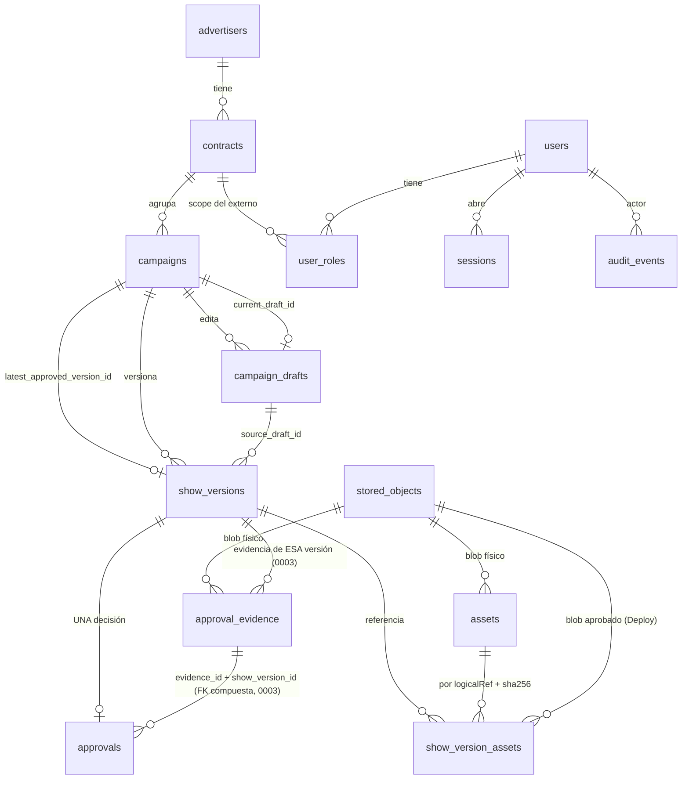

# M3A.1 — Modelo relacional (Fase A + Integrity Gate A.1)

Fuente de verdad: `packages/platform-db/src/migrations/0001_initial.ts`.

## Invariantes que garantiza la BASE (no solo el código)

| Invariante | Mecanismo |
|---|---|
| ShowVersion inmutable, sin estado mutable | Sin columna `status`; trigger `IMMUTABLE_ROW` en UPDATE/DELETE/TRUNCATE; `trust_app` solo SELECT |
| Versión + manifiesto sellados | Único camino: `trust_create_show_version()` (atómica, SECURITY DEFINER); `trust_app` sin INSERT directo; trigger `VERSION_SEALED`: solo se agregan entradas en la misma transacción que creó la versión (xmin) |
| Manifiesto resuelve el blob físico | `show_version_assets.stored_object_id` = objeto del asset (`ASSET_OBJECT_MISMATCH`) |
| Propiedad relacional | FKs compuestas: `current_draft` y `latest_approved` de la MISMA campaña; versión desde un draft de su campaña |
| "Última aprobada" realmente aprobada | trigger `LATEST_NOT_APPROVED` |
| Snapshot de revisión | `source_draft_revision` = revisión actual del draft al crear (`VERSION_DRAFT_REVISION_MISMATCH`) |
| Transiciones de Asset | nace UPLOADING; UPLOADING→VALIDATING→READY; UPLOADING/VALIDATING→REJECTED; READY/REJECTED terminales (`ASSET_TERMINAL`) |
| `version_hash` | índice NO único: mismo contenido en dos campañas = dos versiones con el mismo hash |
| Estado efectivo | SUBMITTED = sin Approval · APPROVED/REJECTED = decisión de su Approval |
| Una decisión por versión | `approvals.show_version_id UNIQUE` |
| La decisión cita el hash exacto | `approvals.version_hash` + trigger `approvals_exact_hash` (0003) |
| Evidencia: tipo ↔ MIME en allowlist y nada después de la decisión | trigger `evidence_insert` (0003) |
| APPROVED con evidencia, REJECTED con motivo | CHECK constraints |
| Cuatro ojos por contrato | `contracts.four_eyes_required DEFAULT true` + trigger `FOUR_EYES_VIOLATION` |
| Blob físico content-addressed e inmutable | `stored_objects.sha256 UNIQUE`; `storage_key` derivada del sha256 (CHECK); trigger inmutable |
| Asset REJECTED fuera de versiones | trigger `ASSET_NOT_READY`; sha256 declarado = el del objeto físico (`ASSET_SHA_MISMATCH`) |
| Revisión monotónica de drafts | trigger `DRAFT_REVISION` (+1 exacto) |
| Auditoría append-only y serializada | lock exclusivo de transacción + trigger `AUDIT_SEQ` / `AUDIT_FORK`; `previous_event_hash UNIQUE` (sin forks); `trust_app` sin UPDATE/DELETE |
| Superficies del edificio | NO se redefinen en la base: se validan contra `EL_TRUST` (`deriveSurfaceFormats`) |

## Migraciones

| # | Nombre | Reversible | Nota |
|---|---|---|---|
| 0001 | initial (actualizada por Integrity Gate A.1; nunca desplegada) | sí (CI) | Producción: forward + backup |

## Roles PostgreSQL

| Rol | Uso | Permisos |
|---|---|---|
| `trust_owner` | migraciones | dueño del esquema |
| `trust_app` | runtime | sin DDL ni TRUNCATE; SELECT/INSERT en `stored_objects`, `approval_evidence`, `approvals`, `audit_events`; solo SELECT en `show_versions`, `show_version_assets`, `audit_head`; EXECUTE en `trust_create_show_version` |

Bootstrap: `packages/platform-db/src/bootstrap.sql` (psql + `\gexec`), validado por `scripts/bootstrap-smoke.sh` sobre un cluster nuevo.
